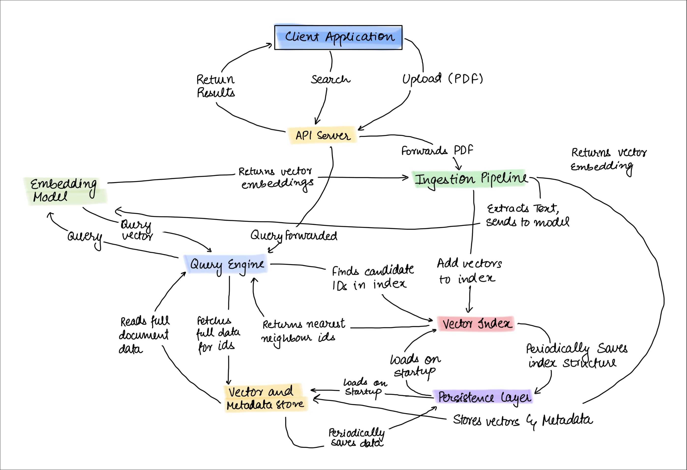

# SCALAR 2.0: A Self-Contained Vector Database & Semantic Search Engine

SCALAR 2.0 is a complete, self-contained vector database service built with Python. It provides all the core functionalities needed to ingest unstructured data from PDFs, transform it into vector embeddings, and perform high-speed semantic searches via a clean REST API.

This project is designed as a foundational engine. It comes with a ready-to-use web UI for demonstration, but its real power lies in its robust API, which can be used to build your own custom AI-powered applications.

## 🏛️ Architecture

The project implements a robust, service-oriented architecture that separates the core database logic from the web-facing layers.




-   **Core Service Layer (`core/vector_service.py`):** The brain of the database, handling all business logic including PDF processing, embedding, indexing with FAISS, and searching.
-   **API Layer (`FastAPI`):** The central gateway that exposes the core service's functionality through a REST API.
-   **UI Layer (`Streamlit`):** A lightweight web interface that consumes the API for easy interaction and demonstration.

## ✨ Key Features

-   **High-Speed Vector Search:** Utilizes `faiss.IndexHNSWFlat` for fast, scalable approximate nearest neighbor search.
-   **Intelligent Ingestion Pipeline:** Extracts text from PDFs, performs context-aware chunking, and generates high-quality vector embeddings.
-   **Persistent Storage:** The entire database state (vector index, metadata, and content) is automatically saved to disk and reloaded on startup.
-   **Robust & Idempotent:** Prevents duplicate document ingestion and gracefully handles invalid or empty PDFs.
-   **Clean REST API:** A well-documented API that exposes all core database functionalities.

## 🛠️ Technology Stack

-   **Backend:** Python 3.11+, FastAPI
-   **Frontend:** Streamlit
-   **AI & ML:** `sentence-transformers`, `faiss-cpu`, `langchain`
-   **PDF Processing:** `PyMuPDF`

## ⚙️ Installation & Setup

Follow these steps to set up and run the project locally.

**1. Clone the Repository**

```bash
git https://github.com/ThinkyMiner/SCALAR2.0.git
cd SCALAR-2.0
```

**2. Create and Activate a Virtual Environment**

```bash
# For macOS / Linux
python3 -m venv venv
source venv/bin/activate

# For Windows
python -m venv venv
.\venv\Scripts\activate
```

**3. Install Dependencies**

```bash
pip install -r requirements.txt
```

## ▶️ Running the Application

This application consists of two main components that must be run in separate terminals: the **backend API** and the **frontend UI**.

**Step 1: Start the Backend API**

Open a terminal and run the following command from the project's root directory:

```bash
uvicorn api.main:app --reload
```
The API will be available at `http://127.0.0.1:8000`. Interactive documentation can be found at `http://127.0.0.1:8000/docs`.

**Step 2: Start the Frontend UI**

Open a **second terminal** and run the following command from the project's root directory:

```bash
streamlit run ui/app.py
```
Streamlit will open a new tab in your web browser at `http://localhost:8501`.

## 📋 Usage Guide

You can interact with SCALAR 2.0 by using its API directly or through the provided web interface.

### Interacting with the API

The FastAPI backend exposes the core functionality of the vector database. This is ideal for building custom applications.

#### 1. Uploading a PDF

Use `curl` or any HTTP client to send a `multipart/form-data` request to the `/upload` endpoint.

```bash
curl -X POST -F "file=@/path/to/your/document.pdf" http://127.0.0.1:8000/upload
```

#### 2. Performing a Search

Send a `POST` request with a JSON payload to the `/search` endpoint.

```bash
curl -X POST -H "Content-Type: application/json" \
-d '{
    "query_text": "What is the main idea of the document?",
    "k": 3
}' \
http://127.0.0.1:8000/search
```

### Example Python Scripts for API Usage

Here are simple Python scripts using the `requests` library to interact with the API.

**`upload_script.py`**
```python
import requests

API_URL = "http://127.0.0.1:8000/upload"
FILE_PATH = "./path/to/your-document.pdf"  # Change this to your file path

with open(FILE_PATH, "rb") as f:
    files = {'file': (FILE_PATH, f, 'application/pdf')}
    try:
        response = requests.post(API_URL, files=files)
        response.raise_for_status()
        print("File uploaded successfully!")
        print(response.json())
    except requests.exceptions.RequestException as e:
        print(f"An error occurred: {e}")
```

**`search_script.py`**
```python
import requests

API_URL = "http://127.0.0.1:8000/search"
query = {
    "query_text": "your search query here",
    "k": 5
}

try:
    response = requests.post(API_URL, json=query)
    response.raise_for_status()
    print("Search results:")
    print(response.json())
except requests.exceptions.RequestException as e:
    print(f"An error occurred: {e}")
```

---

## 🚀 Getting Started & Next Steps

This project provides a powerful vector database engine with a convenient UI, giving you two primary ways to use it:

1.  **As a Complete Search Application:** Simply run the `uvicorn` and `streamlit` commands to launch the full application. You can immediately start uploading documents and performing searches through the web interface with no code changes required.

2.  **As a Backend for Your Own Application:** The true power of SCALAR 2.0 is its API. You can use the backend to power your own custom applications, such as a chatbot, a research assistant, or a document summarizer.

You can start using it immediately via the UI, or you can leverage the powerful API to make changes and build something entirely new. **The choice is yours!**